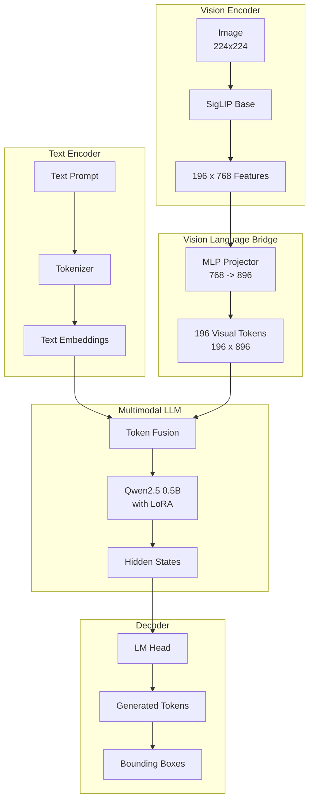
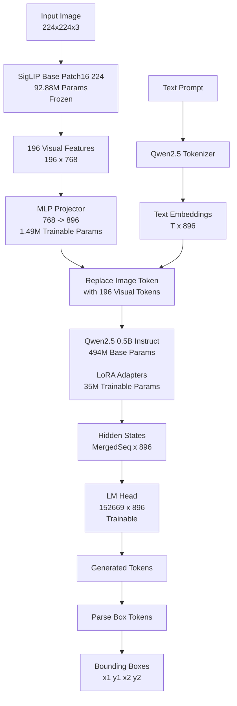

# Architecture

## Overview

EdgeLocate is a VLM for open-vocabulary object detection. Given an image and a text prompt, it autoregressively generates bounding box coordinates as discrete tokens.



## Components

### Vision Encoder (SigLIP-Base-Patch16-224)

- **Params**: 92.88M (frozen)
- **Output**: 196 patch features, each 768-d
- **Selection**: `vision_select_layer=-1` (final layer)

### MLP Projector

- **Params**: 1.49M (trainable)
- **Structure**: `Linear(768, 896) → GELU → Linear(896, 896)`
- **Purpose**: Projects visual features from VE space (768) to LLM space (896)

### LLM (Qwen2.5-0.5B-Instruct)

- **Params**: 494.03M base
- **Trainable via LoRA** (r=64–128): ~35M additional params
- **LoRA targets**: `q_proj, k_proj, v_proj, o_proj, gate_proj, down_proj, up_proj`
- **LoRA init**: A = Kaiming uniform, B = zeros (standard PEFT)
- **LM head**: Untied from input embeddings (`tie_word_embeddings=False`), separately trainable (152669 × 896)

### Vocabulary

| Token | ID | Count |
|---|---|---|
| Base Qwen vocab | 0–151643 | 151644 |
| `<|image|>` | 151665 | 1 |
| `<box>` | 151666 | 1 |
| `</box>` | 151667 | 1 |
| `<0>` – `<1000>` | 151668–152668 | 1001 |
| **Total** | | **152669** |

Coordinate tokens `<n>` map to integer bin `n` in range [0, 1000], representing the normalized coordinate `n / 1000`.

## Visual Feature Injection

The model uses `inputs_embeds` mode: the single `<|image|>` token embedding is replaced by 196 projected visual patch embeddings (each 896-d). The sequence becomes:

```
[sys_tokens, user_tokens, |image|, visual_1...visual_196, prompt_tokens, assistant_tokens]
```

The LLM processes the full merged sequence with KV cache, so hidden states at `assistant` positions are conditioned on visual content.

## Loss

Standard cross-entropy on all tokens. Labels are masked so only the assistant response (starting from `\n` after `assistant`) contributes to the loss. Visual token positions (the 196 injected patches) are set to `-100` (ignored).

## Training Loop

```
For each batch:
  1. Load image → SigLIP → 196×768 patch features
  2. Project via MLP → 196×896 visual tokens
  3. Replace <|image|> in input_ids with visual tokens → merged sequence
  4. Expand labels: insert -100 for visual token positions
  5. LLM forward pass (with LoRA) on merged embeddings
  6. Cross-entropy between logits and expanded labels
  7. Backprop through LM head → LLM+LoRA → projector → VE (VE frozen, no grad)
```

## Inference

Standard `llm.generate()` with `inputs_embeds`:

1. Convert image → 196 visual patch embeddings via VE + projector
2. Merge into text embeddings at `<|image|>` position
3. Pass `inputs_embeds` and `attention_mask` to `llm.generate()`
4. Autoregressively sample tokens until `<|im_end|>` or `max_new_tokens`
5. Parse `<box><d1><d2><d3><d4></box>` from generated text

## File Structure

```
locany/
  __init__.py          # Public API exports
  config.py            # ModelConfig, TrainingConfig, DataConfig, InferenceConfig
  model.py             # LocateAnythingForDetection, create_model, load_model_from_dir
  dataset.py           # DetectionDataset, parse_sharegpt_line
  training.py          # setup_training, DetectionDataCollator, save_model
  inference.py         # DetectionInferenceEngine, visualize_boxes
  eval.py              # compute_iou, compute_precision_recall, evaluate_model
  utils.py             # Token definitions, helpers, parse_boxes_from_text
  create_sample_data.py  # Synthetic dataset generator
train.py               # CLI entry point
infer.py               # Inference pipeline script
```

## Save/Load Format

When LoRA is enabled, saving produces:

- `adapter_config.json` / `adapter_model.safetensors` — LoRA A/B matrices
- `non_llm.pt` — projector, lm_head, embed_tokens weights (non-LoRA trainable params)
- `locany_config.json` — ModelConfig for reconstruction

Loading: creates base model without LoRA, wraps with `PeftModel.from_pretrained`, then loads `non_llm.pt` (with key remapping for PEFT's `base_model.model.` prefix).
