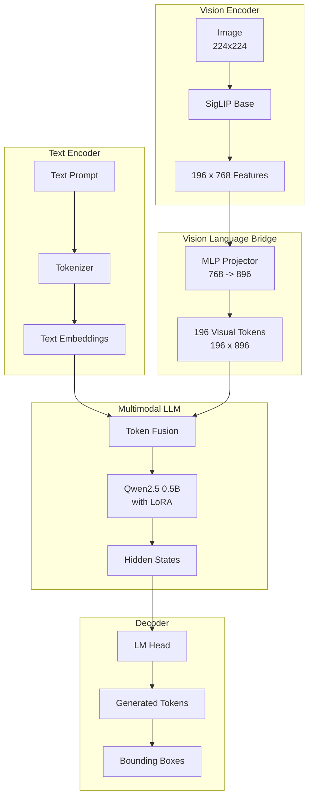
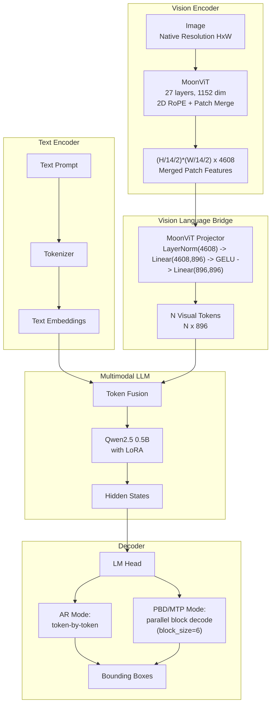
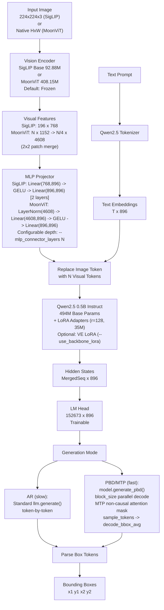

# Architecture

## Overview

EdgeLocate is a VLM for open-vocabulary object detection. Given an image and a text prompt, it autoregressively generates bounding box coordinates as discrete tokens. Supports two vision encoder backends (SigLIP and MoonViT), two generation modes (AR and PBD/MTP), and optional sequence packing.

## Component Diagrams

### SigLIP Backend (Default)



### MoonViT Backend



### Detailed Data Flow



## Components

### Vision Encoder

Two backends auto-selected by model name/path:

#### SigLIP-Base-Patch16-224 (Legacy)
- **Params**: 92.88M (frozen by default)
- **Input**: Resized to 224×224
- **Output**: 196 patch features, each 768-d (final layer)
- **Projector**: `MLPProjector` (768 → 896, 2 layers)

#### MoonViT (Native-Resolution)
- **Params**: 408.15M (frozen by default)
- **Layers**: 27
- **Hidden dim**: 1152
- **Attention heads**: 16
- **Position encoding**: 2D RoPE (learnable + rotary, supports variable resolution)
- **Patch merging**: 2×2 kernel (configurable), producing (H/14/2)×(W/14/2) tokens with 4× channel width
- **Input**: Native resolution (no fixed resize), auto-inferred from pixel values
- **Attention backends**: flash_attention_2, sdpa, eager (varlen with `cu_seqlens`)
- **Projector**: `MoonViTProjector` — LayerNorm(4608) → Linear(4608, 896) → GELU → Linear(896, 896)
- **Detection**: Name/path containing "moonvit" or config containing `merge_kernel_size` field

### MLP Projector

Configurable depth (`--mlp_connector_layers N`):

| Layers | Structure | Use Case |
|--------|-----------|----------|
| 2 | `Linear → GELU → Linear` | SigLIP default |
| 3+ | `LayerNorm → Linear → GELU → Linear → GELU → ...` | MoonViT or deeper alignment |

All layers use weight init `N(0, 0.02)` and zero bias init.

### LLM (Qwen2.5-0.5B-Instruct)

- **Params**: 494.03M base
- **Trainable via LoRA** (r=128, α=256): ~35M additional params
- **LoRA targets**: `q_proj, k_proj, v_proj, o_proj, gate_proj, down_proj, up_proj`
- **LM head**: Untied (`tie_word_embeddings=False`), separately trainable (152673 × 896)
- **Gradient checkpointing**: Supported via `--gradient_checkpointing`

### Backbone LoRA

Optional LoRA on the vision encoder (`--use_backbone_lora N`):
- Targets: `self_attn.q/k/v/out_proj`, `mlp.fc1/fc2`
- Adds ~6M trainable params at r=16
- Initialized with PEFT defaults

## Generation Modes

### Autoregressive (AR) — `slow`
Standard `llm.generate()` with `inputs_embeds`. Token-by-token sampling with temperature and top-p.

### Parallel Box Decoding (PBD/MTP) — `fast` / `hybrid`
`model.generate_pbd()` implements multi-token prediction:

1. **MTP attention mask**: Custom 4D mask (via `create_mtp_attention_mask`) with causal attention on context, non-causal full attention within the `block_size` prediction block
2. **Parallel sampling**: `sample_tokens()` processes all `block_size` logits simultaneously, then `decode_bbox_avg()` averages top-k coordinate candidates for refined box tokens
3. **Fast mode**: Pure MTP throughout — all tokens decoded in parallel blocks
4. **Hybrid mode**: MTP for box tokens, AR fallback for text tokens; on malformed MTP output, resets to AR for that box boundary
5. **`handle_pattern()`**: Routes generated tokens to box averaging, text continuation, or `<|im_end|>` detection

PBD requires `batch_size=1` and uses `use_cache=False` (no KV cache within prediction blocks).

### generate_pbd() Loop

```
For each step:
  1. If MTP mode:
     a. Append block_size mask tokens to current embeddings
     b. Create MTP attention mask (causal context, non-causal block)
     c. Forward pass through LLM
     d. Sample block_size tokens: sample_tokens() + decode_bbox_avg()
     e. handle_pattern() determines box/text/end
     f. If hybrid mode and box error: fall back to AR
  2. If AR mode:
     a. Forward pass single token
     b. Sample next token
     c. On </box>: switch back to MTP (hybrid mode)
     d. On <|im_end|>: stop
```

## Sequence Packing

`PackedDetectionDataset` concatenates multiple training samples into one sequence:

- **Greedy packing**: Samples are added until `max_packed_tokens` is reached
- **sub_sample_lengths**: Tensor recording each constituent sample's length, passed to the model
- **Custom 4D attention mask**: Created in `forward()` when `sub_sample_lengths` is present — masks cross-sample attention while maintaining causal within-sample masking
- **Per-sample position_ids**: Each sample's tokens use `[0, 1, ..., len-1]`, creating detectable boundaries
- **`PackedDataCollator`**: Stacks packed batches with all metadata intact

## Vocabulary

Tokens added via `setup_tokenizer()` in order:

| Token | ID | Count |
|---|---|---|
| Base Qwen vocab | 0–151664 | 151665 |
| `<\|image\|>` | 151665 | 1 |
| `<box>` | 151666 | 1 |
| `</box>` | 151667 | 1 |
| `<ref>` | 151668 | 1 |
| `</ref>` | 151669 | 1 |
| `<0>`–`<1000>` | 151670–152670 | 1001 |
| `<null>` | 152671 | 1 |
| `<text_mask>` | 152672 | 1 |
| **Total** | | **152673** |

Coordinate tokens `<n>` map to integer bin `n` in range [0, 1000], representing the normalized coordinate `n / 1000`.

## Visual Feature Injection

Both backends use `inputs_embeds` mode: the `<|image|>` token embedding is replaced by projected visual patch embeddings. The sequence becomes:

```
[sys_tokens, user_tokens, |image|, visual_1...visual_N, prompt_tokens, assistant_tokens]
```

- **SigLIP**: N = 196 (14×14 patches at 224×224)
- **MoonViT**: N = (H/14/2) × (W/14/2) (variable, e.g., 256 at 448×448)

## Loss

Standard cross-entropy on all tokens. Labels are masked so only the assistant response contributes to the loss. Visual token positions (the N injected patches) are set to `-100` (ignored).

## Training Loop

```
For each batch:
  1. Load image → VE → N patch features
  2. Project via MLP → N visual tokens (896-d)
  3. Replace <|image|> in input_ids with visual tokens → merged sequence
  4. Expand labels: insert -100 for visual token positions
  5. LLM forward pass (with LoRA, optional backbone LoRA) on merged embeddings
  6. Cross-entropy between logits and expanded labels
  7. Backprop through LM head → LLM+LoRA → projector → VE (VE frozen by default)
```

### Packed Training

```
For each packed batch (from PackedDetectionDataset):
  1. Compute per-sample position_ids and sub_sample_lengths
  2. Create 4D attention mask (cross-sample masked, within-sample causal)
  3. Forward pass with position_ids, attention_mask, sub_sample_lengths
  4. Standard cross-entropy on full packed sequence
```

## Inference

### AR (Default)
1. Convert image → N visual patch embeddings via VE + projector
2. Merge into text embeddings at `<|image|>` position
3. Pass `inputs_embeds` and `attention_mask` to `llm.generate()`
4. Autoregressively sample tokens until `<|im_end|>` or `max_new_tokens`
5. Parse `<box><d1><d2><d3><d4></box>` from generated text

### PBD/MTP (MoonViT)
1. Same visual feature extraction as AR
2. Call `model.generate_pbd()` with `pixel_values`, `input_ids`, `attention_mask`
3. Returns generated token IDs (excluding input context)
4. Parse boxes from decoded text

## File Structure

```
locany/
  __init__.py              # Public API exports (39 items)
  config.py                # ModelConfig, TrainingConfig, DataConfig, InferenceConfig
  model.py                 # LocateAnythingForDetection
                           #   Dual VE: SigLIP + MoonViT auto-detection
                           #   MLPProjector + MoonViTProjector
                           #   VisionEncoderWrapper (VE loading/inference)
                           #   create_mtp_attention_mask
                           #   generate_pbd() — PBD/MTP generation
                           #   Packed forward support (sub_sample_lengths)
  dataset.py               # DetectionDataset, PackedDetectionDataset, parse_sharegpt_line
  modeling_vit.py          # MoonViT: MoonViTConfig, MoonVitPretrainedModel
                           #   MoonVitEncoder (27 layers, 2D RoPE)
                           #   MoonVisionPatchEmbed, Learnable2DInterpPosEmb
                           #   Rope2DPosEmb, patch_merger
                           #   Attention: flash/sdpa/eager (varlen)
  training.py              # setup_training, DetectionDataCollator, PackedDataCollator, save_model
  inference.py             # DetectionInferenceEngine, visualize_boxes
  eval.py                  # compute_iou, compute_precision_recall, evaluate_model
  utils.py                 # Token ID constants, SPECIAL_TOKENS, setup_tokenizer
                           #   parse_boxes_from_text, denormalize_boxes
  generate_utils.py        # PBD helpers: sample_tokens, handle_pattern, decode_bbox_avg
                           #   decode_ref, is_valid_box_frame, top_p/top_k, repetition_penalty
  create_sample_data.py    # Synthetic dataset generator
train.py                   # CLI entry point (training/inference/prepare)
infer.py                   # Inference pipeline script
```

## Save/Load Format

When LoRA is enabled, saving produces:

- `adapter_config.json` / `adapter_model.safetensors` — LoRA A/B matrices
- `non_llm.pt` — projector, lm_head, embed_tokens weights (non-LoRA trainable params)
- `locany_config.json` — ModelConfig for reconstruction

Loading: creates base model without LoRA, wraps with `PeftModel.from_pretrained`, then loads `non_llm.pt` (with key remapping for PEFT's `base_model.model.` prefix).

## Configuration Reference

Key `ModelConfig` fields:

| Field | Default | Description |
|---|---|---|
| `llm_model` | `Qwen/Qwen2.5-0.5B-Instruct` | LLM backbone |
| `ve_model` | `google/siglip-base-patch16-224` | Vision encoder |
| `ve_hidden_size` | 768 | VE output dim (set 1152 for MoonViT) |
| `llm_hidden_size` | 896 | LLM hidden dim |
| `use_lora` | True | LoRA on LLM |
| `use_backbone_lora` | 0 | LoRA rank on VE (0 = off) |
| `mlp_connector_layers` | 2 | MLP projector depth |
| `block_size` | 6 | PBD prediction block size |
| `generation_mode` | `hybrid` | PBD: hybrid/fast/slow |
| `n_future_tokens` | 6 | MTP future tokens |
| `freeze_vision_encoder` | True | Freeze VE weights |
| `freeze_llm` | False | Freeze LLM weights |
| `attn_implementation` | `sdpa` | Attention backend |
