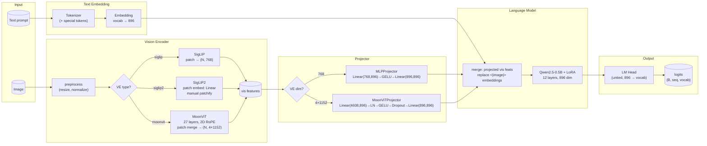

# EdgeLocate Architecture

EdgeLocate is a vision-language detection model (<1B params) ported from NVIDIA's [LocateAnything (EagleVL)](https://github.com/NVIDIA/LocateAnything). It predicts bounding boxes as discrete coordinate tokens via standard cross-entropy loss through an LM head, using a vision encoder → MLP projector → Qwen2.5 LLM + LoRA pipeline.

## Model Architecture


```mermaid
flowchart LR
    subgraph Input["Input"]
        IMG[("Image")]
        TXT[("Text prompt")]
    end

    subgraph VE["Vision Encoder"]
        PRE["preprocess<br/>(resize, normalize)"] --> VE_SEL{"VE type?"}
        VE_SEL -->|"siglip"| SIGLIP["SigLIP<br/>patch → (N, 768)"]
        VE_SEL -->|"siglip2"| SIGLIP2["SigLIP2<br/>patch embed: Linear<br/>manual patchify"]
        VE_SEL -->|"moonvit"| MOON["MoonViT<br/>27 layers, 2D RoPE<br/>patch merge → (N, 4×1152)"]
        SIGLIP --> OUT[("vis features")]
        SIGLIP2 --> OUT
        MOON --> OUT
    end

    subgraph Proj["Projector"]
        OUT --> P_SEL{"VE dim?"}
        P_SEL -->|768| MLP2["MLPProjector<br/>Linear(768,896)→GELU→Linear(896,896)"]
        P_SEL -->|"4×1152"| MLP3["MoonViTProjector<br/>Linear(4608,896)→LN→GELU→Dropout→Linear(896,896)"]
    end

    subgraph TextEmbed["Text Embedding"]
        TXT --> TOK["Tokenizer<br/>(+ special tokens)"]
        TOK --> EMB["Embedding<br/>vocab → 896"]
    end

    subgraph LLM["Language Model"]
        MERGE["merge: projected vis feats<br/>replace &lt;|image|&gt; embeddings"]
        EMB --> MERGE
        MLP2 --> MERGE
        MLP3 --> MERGE
        MERGE --> QWEN["Qwen2.5-0.5B  + LoRA<br/>12 layers, 896 dim"]
    end

    subgraph Head["Output"]
        QWEN --> LMH["LM Head<br/>(untied, 896 → vocab)"]
        LMH --> LOGITS[("logits<br/>(B, seq, vocab)")]
    end

    IMG --> PRE
```

    style Input fill:#e1f5fe
    style VE fill:#f3e5f5
    style Proj fill:#fff3e0
    style TextEmbed fill:#e8f5e9
    style LLM fill:#ffebee
    style Head fill:#fce4ec
```

## Files

| File | Role |
|---|---|
| `model.py` | `LocateAnythingForDetection` — dual VE dispatch, projector, `generate_pbd()`, packed forward |
| `modeling_vit.py` | `MoonViTModel` — 27-layer ViT, 2D RoPE, patch merge (2×2 kernel, 4× channel) |
| `generate_utils.py` | PBD sampling: `sample_tokens()`, `decode_bbox_avg()`, `handle_pattern()`, MTP mask |
| `config.py` | `ModelConfig`, `TrainingConfig`, `DataConfig`, `InferenceConfig`, CLI parser |
| `utils.py` | Token IDs, `setup_tokenizer()`, `parse_boxes_from_text()`, `load_image()` |
| `dataset.py` | `DetectionDataset` (single + recipe), `PackedDetectionDataset`, `_SubDataset` |
| `training.py` | `setup_training()` (HF Trainer), `DetectionDataCollator`, `TrainVisCallback` (epoch vis) |
| `inference.py` | `DetectionInferenceEngine.predict()` (single) and `predict_batch()`, `visualize_prediction()` |
| `eval.py` | `run_benchmark()`, `compute_coco_ap()`, COCO metrics pipeline |

## Vision Encoder

### SigLIP (`VisionEncoderWrapper`)
- Standard HuggingFace ViT models (SigLIP, SigLIP2, MobileCLIP)
- Returns `(B, N_patches, D)` features at fixed resolution
- Frozen by default

### MoonViT (`MoonViTModel`)
- 27-layer ViT, 1152 hidden dim, native-resolution support
- **2D RoPE**: Rotary position embeddings in 2D grid space
- **Patch merge**: 2×2 kernel after encoder produces `(H/14/2)×(W/14/2)` tokens with 4× channel width
- Auto-detected via `config.model_type == "moonvit"` or name containing "moonvit"
- Required for PBD generation

### VE Auto-detection
1. Check `raw.model_type == "moonvit"` → MoonViT path
2. Check model name for "siglip2" → SigLIP2 (adds `pixel_attention_mask`, `spatial_shapes`)
3. Else → standard SigLIP path

### SigLIP2 Special Handling
- `Siglip2VisionEmbeddings.__init__` creates `nn.Linear(768, 768)` as patch_embedding (not `nn.Conv2d`)
- `forward()` passes raw `(B, 3, H, W)` pixels → must manually patchify upstream
- HF `from_pretrained` returns dual `Siglip2Model` (vision+text) → unwrap via `.vision_model`
- `SiglipConfig` nests `vision_config` → all `hidden_size`/`patch_size` lookups check `hasattr(cfg, 'vision_config')`

## Projector

### MLPProjector (SigLIP/MoonViT)
- 2-layer MLP: `Linear(hidden_size, 896)` → GELU → `Linear(896, 896)`, no bias
- Input cast to projector dtype at runtime (avoids `DataParallel` dtype mismatches)

### MoonViTProjector
- 3-layer MLP with LayerNorm and Dropout
- Input: `hidden_size * 4` (post-merge MoonViT channels)

## Token Scheme

| Token | ID | Description |
|---|---|---|
| `<\|image\|>` | 151665 | Image anchor in user text |
| `<box>` | 151666 | Box start |
| `</box>` | 151667 | Box end |
| `<ref>` | 151668 | Reference/label start |
| `</ref>` | 151669 | Reference/label end |
| `<0>`–`<1000>` | 151670–152670 | Coordinate tokens (1001 bins) |
| `<null>` | 152671 | No detection |
| `<text_mask>` | 152672 | MTP mask token |

Total vocabulary: 152673 tokens (8 special + 1001 coord + base Qwen2.5 vocab).

## Generation Modes

Controlled by `InferenceConfig.mode` (`--mode {fast,hybrid,slow}`, default `hybrid`).

### AR mode (`slow`)
Standard `model.generate()` via HF `GenerationConfig`. Auto-regressive token-by-token.

### PBD/Fast mode (`fast`)
`model.generate_pbd()` predicts `block_size` tokens (default 6) in parallel using a non-causal MTP attention mask:

```python
def create_mtp_attention_mask(context_len, block_size):
    # Causal on context tokens
    # Non-causal within the prediction block (all block tokens see each other)
```

Block tokens are decoded via:
1. `sample_tokens()` — top-1 from logits, with `decode_bbox_avg()` for coordinate averaging
2. `decode_bbox_avg()` — averages top-k coordinate token logits for smoother box predictions
3. `handle_pattern()` — classifies output (`coord_box`, `error_box`, `empty_box`, `im_end`)

### Hybrid mode (`hybrid`)
Starts in MTP mode. On `error_box` pattern, falls back to AR for that box. On `</box>` token in AR, resumes MTP.

### Inference dispatch
```python
if mode != 'slow' and is_moonvit:
    model.generate_pbd(...)
else:
    model.generate(...)
```

`predict_batch()` does not support PBD; when PBD is selected in `eval.py`, it uses single-image `predict()` in a loop.

## Training

Standard autoregressive next-token prediction via HuggingFace `Trainer`. No MTP loss during training.

### Loss
Cross-entropy on LLM output logits. Labels mask user text (set to `IGNORE_INDEX=-100`), only compute loss on assistant (GPT) response tokens including coordinate tokens.

### Data augmentation
When `data_augment=True` in recipe config: with 50% probability, randomly resize image long edge to `[640, 2560]` preserving aspect ratio, then resize to model input size. This matches LocateAnything's augmentation strategy.

### Sequence packing
`PackedDetectionDataset` greedily concatenates samples up to `max_packed_tokens` per item. Each sample gets its own `position_ids` starting from 0. `PackedDataCollator` stacks with `sub_sample_lengths` for per-sample causal masking.

### Epoch visualization
`TrainVisCallback` saves `epoch_N.jpg` at train start and after each epoch showing 8 random augmentations per image.

## Coordinate System

- Coordinates are quantized to `[0, 1000]` integer bins (1001 tokens)
- Stored in JSONL as `<d1><d2><d3><d4>` within `<box>` tags
- Denormalized to pixel space via `pixel = coord * image_dim / 1000`
- Both GT and predictions are denormalized before metric computation in `eval.py` using each image's actual width/height

## Evaluation Metrics

Standard COCO evaluation:
- `AP`: mean Average Precision @ IoU thresholds 0.50:0.05:0.95
- Per-threshold metrics: `AP@0.50`, `AP@0.75`, `AP@0.90`
- `F1`, `Precision`, `Recall` at each threshold

Computed in `eval.py` via `compute_coco_ap()` (11-point interpolation) and `compute_precision_recall()`.

## Key Design Decisions

- **Discrete tokens over regression**: Cross-entropy provides per-class supervision through full model (LM head → LLM → projector → VE). Gradients flow to all components, unlike MSE regression on a separate head.
- **LoRA on LLM** (r=64–128): Makes training feasible on 4GB GPU while allowing the LLM to learn image-dependent hidden states at coordinate positions.
- **Optional VE LoRA** (`--use_backbone_lora N`): LoRA on VE attention/MLP for fine-grained visual adaptation.
- **Untied LM head** (`tie_word_embeddings=False`): Coordinate token LM head trains independently from input embeddings.
- **Frozen VE by default**: Saves memory; projector + LoRA adapt visual features to LLM space.
