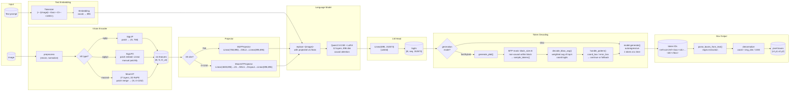

# EdgeLocate Architecture

EdgeLocate is a <1B vision-language detection model ported from NVIDIA's [LocateAnything (EagleVL)](https://github.com/NVIDIA/LocateAnything). It predicts bounding boxes as **discrete coordinate tokens** (`<0>`–`<1000>`) via cross-entropy loss through the LM head — no regression head, no object queries. The pipeline is: vision encoder → MLP projector → Qwen2.5 LLM + LoRA → LM head.

| Total params | Trainable params | VE | LLM | VRAM (train) |
|---|---|---|---|---|
| ~589M (SigLIP) / ~904M (MoonViT) | ~37–44M | Frozen (or LoRA) | LoRA r=128 | ~4–8 GB |

---

## 1. System Architecture


```mermaid
flowchart LR
    subgraph Input["Input"]
        IMG[("Image")]
        TXT[("Text prompt")]
    end

    subgraph VE["Vision Encoder"]
        PRE["preprocess<br/>(resize, normalize)"] --> VE_SEL{"VE type?"}
        VE_SEL -->|"siglip"| SIGLIP["SigLIP<br/>patch → (N, 768)"]
        VE_SEL -->|"siglip2"| SIGLIP2["SigLIP2<br/>patch embed: Linear<br/>manual patchify"]
        VE_SEL -->|"moonvit"| MOON["MoonViT<br/>27 layers, 2D RoPE<br/>patch merge → (N, 4×1152)"]
        SIGLIP --> FEAT[("vis features<br/>(B, N, D_ve)")]
        SIGLIP2 --> FEAT
        MOON --> FEAT
    end

    subgraph Proj["Projector"]
        FEAT --> P_SEL{"VE dim?"}
        P_SEL -->|768| MLP2["MLPProjector<br/>Linear(768,896)→GELU→Linear(896,896)"]
        P_SEL -->|"4×1152"| MLP3["MoonViTProjector<br/>Linear(4608,896)→LN→GELU→Dropout→Linear(896,896)"]
    end

    subgraph TextEmbed["Text Embedding"]
        TXT --> TOK["Tokenizer<br/>(+ &lt;|image|&gt; &lt;box&gt; &lt;0&gt;–&lt;1000&gt;)"]
        TOK --> EMB["Embedding<br/>vocab → 896"]
    end

    subgraph LLM["Language Model"]
        MERGE["replace &lt;|image|&gt;<br/>with projected vis feats"]
        EMB --> MERGE
        MLP2 --> MERGE
        MLP3 --> MERGE
        MERGE --> QWEN["Qwen2.5-0.5B + LoRA<br/>12 layers, 896 dim<br/>causal attention"]
    end

    subgraph Head["LM Head"]
        QWEN --> LMH["Linear(896, 152673)<br/>(untied)"]
        LMH --> LOGITS[("logits<br/>(B, seq, 152673)")]
    end

    subgraph Decode["Token Decoding"]
        LOGITS --> GEN{"generation<br/>mode?"}
        GEN -->|"slow"| AR["model.generate()<br/>autoregressive<br/>1 token at a time"]
        GEN -->|"fast/hybrid"| PBD["generate_pbd()"]
        PBD --> MTP["MTP mask: block_size=6<br/>non-causal within block<br/>→ sample_tokens()"]
        MTP --> AVG["decode_bbox_avg()<br/>weighted avg of top-k<br/>coord logits"]
        AVG --> PAT["handle_pattern()<br/>coord_box / error_box<br/>→ continue or fallback"]
        PAT --> AR
    end

    subgraph BoxOut["Box Output"]
        AR --> TOKENS[("token IDs<br/>&lt;ref&gt;cat&lt;/ref&gt;&lt;box&gt;&lt;d1&gt;…&lt;d4&gt;&lt;/box&gt;")]
        TOKENS --> PARSE["parse_boxes_from_text()<br/>regex extraction"]
        PARSE --> DENORM["denormalize<br/>coord × img_dim / 1000"]
        DENORM --> PIXEL[("pixel boxes<br/>(x1,y1,x2,y2)")]
    end

    IMG --> PRE
```

---

## 2. Discrete Coordinate Tokens

The core design choice: bounding box coordinates are **vocabulary tokens**, not regression targets.

### Why discrete tokens
- Cross-entropy loss provides strong per-class supervision through every layer (LM head → LLM → projector → VE)
- Gradients flow to all components, unlike MSE on a separate regression head where gradients are shallow
- Naturally handles multi-label, multi-box outputs through autoregressive generation

### Coordinate encoding (pixel → token)

During data preparation, COCO pixel coordinates `(x1, y1, x2, y2)` are quantized to `[0, 1000]` integer bins:

```
x1_token = int(x1_pixel * 1000 / img_width)
y1_token = int(y1_pixel * 1000 / img_height)
x2_token = int(x2_pixel * 1000 / img_width)
y2_token = int(y2_pixel * 1000 / img_height)
```

These become vocabulary tokens `<d1>`, `<d2>`, `<d3>`, `<d4>` (IDs 151670–152670), serialized as:

```
<ref>cat</ref><box><d1><d2><d3><d4></box>
```

### Coordinate decoding (token → pixel)

During inference and evaluation, the reverse:

```
x1_pixel = int(x1_token * img_width / 1000)
y1_pixel = int(y1_token * img_height / 1000)
```

Both GT and predictions are denormalized to original image pixel space before metric computation.

### Token scheme

| Token | ID | Usage |
|---|---|---|
| `<\|image\|>` | 151665 | Image anchor — replaced by visual features at merge |
| `<box>` | 151666 | Marks start of box coordinate sequence |
| `</box>` | 151667 | Marks end of box coordinate sequence |
| `<ref>` | 151668 | Start of object label/name |
| `</ref>` | 151669 | End of object label/name |
| `<0>`–`<1000>` | 151670–152670 | 1001 quantized coordinate bins (4 per box) |
| `<null>` | 152671 | Special token: no detection (reserved) |
| `<text_mask>` | 152672 | MTP mask placeholder for PBD block decoding |

Vocabulary size: 152673 (base Qwen2.5 + 1001 coord + 8 special).

---

## 3. Vision Encoder

Three encoder paths are supported, auto-detected at model load:

| Encoder | Resolution | Output Dim | Preprocessing | PBD Support |
|---|---|---|---|---|
| SigLIP | 224×224 | 768 | Resize + normalize | Yes |
| SigLIP2 | 224×224 (or naflex) | 768 | Resize + normalize, manual patchify | Yes |
| MoonViT | Native | 1152 (×4 after merge) | Tile-align, patchify | Yes |

### SigLIP (`VisionEncoderWrapper`)
Standard HuggingFace ViT model (`google/siglip-base-patch16-224`). Image is resized to 224×224, normalized `mean=0.5, std=0.5`, passed through the encoder. Returns `(B, 196, 768)` patch features. Frozen by default.

### SigLIP2
Similar to SigLIP but with special handling in transformers 5.12.1:
- `Siglip2VisionEmbeddings.__init__` creates `nn.Linear(768, 768)` as patch_embedding instead of `nn.Conv2d(768, 3, 16, 16)`
- `forward()` passes raw `(B, 3, H, W)` pixels → must manually patchify upstream into `(B, N, 768)` before the Linear layer
- HF `from_pretrained` returns dual `Siglip2Model` (vision+text) → must unwrap via `.vision_model` (checked via `hasattr(encoder, 'text_model')`)
- `SiglipConfig` nests `vision_config` → all `hidden_size`/`patch_size` lookups check `hasattr(cfg, 'vision_config')` first

### MoonViT (`MoonViTModel`)
27-layer ViT with 1152 hidden dim. Designed for native-resolution input:
- **2D RoPE**: Rotary position embeddings applied in 2D grid space (not 1D sequence), enabling variable-resolution generalization
- **Patch merge**: After the encoder, a 2×2 kernel merges adjacent patches → output `(H/14/2)×(W/14/2)` tokens with 4× channel width (4608 dim)
- **Auto-detection**: Triggered by `config.model_type == "moonvit"` or model name containing "moonvit"
- **PBD acceleration**: Parallel box decoding works with any vision encoder; MoonViT benefits most from PBD due to its higher resolution and larger patch count.

---

## 4. Projector

Maps vision encoder output to the LLM's 896-dim embedding space.

### MLPProjector (SigLIP/SigLIP2)
```
Linear(768 → 896) → GELU → Linear(896 → 896)
```
No bias, no normalization. Input cast to projector dtype at runtime to avoid `DataParallel` dtype mismatches.

### MoonViTProjector
```
Linear(4608 → 896) → LayerNorm → GELU → Dropout → Linear(896 → 896)
```
3-layer with LayerNorm and dropout. The 4608 input comes from MoonViT's 4× channel expansion after patch merge.

---

## 5. Language Model

Base: `Qwen/Qwen2.5-0.5B-Instruct` (12 layers, 896 hidden dim, 0.5B params).

### LoRA
Applied to all attention projection matrices (`q_proj`, `k_proj`, `v_proj`, `o_proj`) with rank `r=128`, alpha=256. Only LoRA weights + projector + LM head are trainable (~37M params). The base LLM and VE stay frozen.

### Visual feature merge
The `<|image|>` token (ID 151665) in the user prompt's embedding sequence is **replaced** by the projected visual features. The LLM sees a sequence like:

```
[text embeddings ... projected_vis_feats ... text embeddings]
```

where `projected_vis_feats` occupies the position(s) of `<|image|>`.

### LM Head
Untied (`tie_word_embeddings=False`). Projects 896-dim LLM output → vocabulary logits (152673 classes). The coordinate token logits at positions corresponding to `<d1>`–`<d4>` in the assistant response are trained via cross-entropy against the ground-truth coordinate tokens.

---

## 6. Parallel Box Decoding (PBD)

PBD accelerates inference by predicting multiple tokens at once instead of one-by-one. It uses **Multi-Token Prediction (MTP)** — a non-causal attention mask within a block of `block_size` tokens, allowing them to be decoded in parallel.

### MTP Attention Mask

```python
def create_mtp_attention_mask(context_len, block_size, device, dtype):
    # Shape: (1, 1, total_len, total_len) where total_len = context_len + block_size
    for i in range(total_len):
        if i < context_len:
            # Causal: each context token attends to itself + previous
            mask[0, 0, i, :i+1] = 0.0
        else:
            # Block tokens attend to ALL context tokens (full visibility)
            mask[0, 0, i, :context_len] = 0.0
            # Block tokens attend to ALL other block tokens (non-causal)
            mask[0, 0, i, context_len:] = 0.0
```

- Context tokens (user prompt + image features) use standard causal masking
- The `block_size` prediction tokens see each other (non-causal within the block)
- All block tokens see the full context

### Block Decoding Flow

```
LLM forward pass with MTP mask
        │
        ▼
logits: (1, block_size, vocab)
        │
        ▼
sample_tokens(logits, ...)
  ├── top-1 greedy for non-coord positions
  └── decode_bbox_avg() for coord positions
        │
        ▼
6 decoded tokens: [<box>, d1_avg, d2_avg, d3_avg, d4_avg, </box>]
        │
        ▼
handle_pattern(tokens)
  ├── "coord_box"    → valid box, continue MTP
  ├── "error_box"    → malformed box (hybrid: fallback to AR)
  ├── "empty_box"    → <null> pattern, no box
  ├── "im_end"       → generation end
  └── "ref_object"   → text label token, switch to AR
        │
        ▼
append tokens to generated sequence, repeat
```

### `sample_tokens()` algorithm

1. Take logits from MTP block `(1, block_size, vocab)`
2. Apply temperature + top-p sampling if configured
3. Greedily sample `x0` for each of the `block_size` positions
4. Identify coordinate positions: the 4 tokens after `<box>` (position 1–4 in the `[<box>, d1, d2, d3, d4, </box>]` pattern)
5. Call `decode_bbox_avg()` on those positions

### `decode_bbox_avg()` algorithm

For each coordinate position in the block:

1. Take the top-k (`keep_k_avg=4`) token logits within the coordinate token range `[COORD_START, COORD_START+1000]`
2. Compute softmax over those top-k logits
3. Weighted average of the coordinate values:
   ```
   avg_coord = sum(softmax_score_i * coord_value_i) / sum(scores)
   ```
4. Round to nearest integer in `[0, 1000]`
5. In `hybrid` mode: only average if the top-1 probability is low AND the spread across candidates is wide
6. In `fast` mode: always average

This produces smoother box coordinates than naive top-1 argmax.

### `handle_pattern()` classification

The 6 decoded tokens are classified into pattern types:

| Pattern | Condition | Action |
|---|---|---|
| `coord_box` | 6 tokens = `[<box>, 4×coord, </box>]` | Continue MTP |
| `error_box` | `<box>` present but missing/malformed coordinates | Hybrid: fallback to AR for this box |
| `empty_box` | Contains `<null>` token | Skip, continue MTP |
| `im_end` | Contains `im_end` token | Stop generation |
| `ref_object` | Contains `<ref>` tag | Text decoding needed → AR |

### Generation modes

| Mode | Behavior | Speed | When to use |
|---|---|---|---|
| `fast` | Always MTP, never falls back | Fastest | When output quality is reliable and maximum speed needed |
| `hybrid` (default) | MTP for box tokens, falls back to AR on `error_box`, resumes MTP after `</box>` | Fast | Recommended — balances speed and robustness |
| `slow` | Pure autoregressive (`model.generate()`) | Baseline | Any VE, backward compatibility |

### Dispatch logic

```python
def predict(image, text):
    if config.mode != 'slow':
        model.generate_pbd(...)
    else:
        model.generate(...)  # standard HF GenerationConfig
```

`predict_batch()` does not support PBD. When PBD is selected in `eval.py` (`--mode hybrid/fast`), it falls back to single-image `predict()` calls in a loop.

---

## 7. Training Pipeline

### Loss
Standard cross-entropy on LLM logits. Labels are masked with `IGNORE_INDEX=-100` for user/human text tokens — loss is only computed on the assistant (GPT) response span, which includes the `<ref>cat</ref><box><d1><d2><d3><d4></box>` tokens. No MTP loss; PBD is inference-only.

### Data augmentation
When `data_augment=True` per dataset in the recipe config:

1. Load image at original resolution
2. With 50% probability: randomly pick target long-edge length in `[640, 2560]`, resize preserving aspect ratio using `Image.LANCZOS`
3. Always: final resize to model input size (e.g., 224×224) + ToTensor + Normalize `(mean=0.5, std=0.5)`

This matches the LocateAnything augmentation strategy. The random long-edge resize introduces scale diversity without distorting aspect ratios.

### Sequence packing
`PackedDetectionDataset` greedily concatenates samples into a single sequence up to `max_packed_tokens` (default 2048): each sample's `input_ids`, `labels`, and `position_ids` are concatenated, with each sample's `position_ids` starting from 0. The model uses `sub_sample_lengths` to create per-sample causal boundaries.

### Epoch visualization
`TrainVisCallback` saves `epoch_N.jpg` at training start (epoch 0) and after each epoch, showing 8 random augmentations per sampled image in a grid. Automatically enabled; no flag required.

### Box coordinate accuracy during training
Since coordinates are discrete tokens, the model must learn to predict exact integer values in `[0, 1000]`. At 224×224 resolution, one token step ≈ 0.224 pixels (for 224-wide images) or larger for higher-resolution images. This is sufficient for detection tasks where IoU-based metrics tolerate sub-pixel imprecision.

---

## 8. Inference & Evaluation

### Box parsing
Generated text is parsed via regex:

```python
# Primary pattern (with label)
r"<ref>([^<]*)</ref><box><(\d+)><(\d+)><(\d+)><(\d+)></box>"
# Bare pattern (no label)
r"<box><(\d+)><(\d+)><(\d+)><(\d+)></box>"
# Fallback for malformed output
r"<(\d+)><(\d+)><(\d+)><(\d+)></box>"
```

Returns `List[List[float]]` with 4-element boxes `[x1, y1, x2, y2]` in 0-1000 token space.

### Coordinate denormalization
Both GT and prediction boxes are converted from token space to pixel space per-image:

```
x1_pixel = x1_token * img_width / 1000
y1_pixel = y1_token * img_height / 1000
```

This is done in `eval.py` via `_denorm_boxes()` and within `inference.py`'s `_parse_boxes()` method.

### Metrics
Standard COCO evaluation computed in `eval.py`:

| Metric | Method | Description |
|---|---|---|
| `AP` | `compute_coco_ap()` | Mean AP @ IoU 0.50:0.05:0.95 (11-point interpolation) |
| `AP@0.50` | same | PASCAL VOC standard |
| `AP@0.75` | same | Strict localization |
| `mean_iou` | `compute_iou()` | Mean pairwise IoU |
| `Precision`/`Recall`/`F1` | `compute_precision_recall()` | Per-threshold + mean |

---

## 9. Files

| File | Responsibility |
|---|---|
| `model.py` | `LocateAnythingForDetection` — dual VE dispatch, projector, `generate_pbd()`, `forward()` |
| `modeling_vit.py` | `MoonViTModel` — 27-layer ViT, 2D RoPE, patch merge |
| `generate_utils.py` | `sample_tokens()`, `decode_bbox_avg()`, `handle_pattern()`, `create_mtp_attention_mask()` |
| `config.py` | `ModelConfig`, `TrainingConfig`, `DataConfig`, `InferenceConfig`, CLI parser |
| `utils.py` | Token constants, `setup_tokenizer()`, `parse_boxes_from_text()`, `load_image()` |
| `dataset.py` | `DetectionDataset` (single + recipe), `PackedDetectionDataset`, `_SubDataset`, `parse_sharegpt_line()` |
| `training.py` | `setup_training()` (HF Trainer), `DetectionDataCollator`, `PackedDataCollator`, `TrainVisCallback` |
| `inference.py` | `DetectionInferenceEngine.predict()`, `predict_batch()`, `_parse_boxes()`, `visualize_prediction()` |
| `eval.py` | `run_benchmark()`, `benchmark_on_jsonl()`, `compute_coco_ap()`, `compute_iou()` |

---

## 10. Key Design Decisions

- **Discrete tokens over regression**: Cross-entropy provides per-class supervision through all layers. Gradients flow to the full model, unlike MSE on a separate head where gradients are shallow.
- **LoRA on LLM (r=128)**: Makes training feasible on 4GB GPU while allowing the LLM to learn image-dependent hidden states at coordinate positions.
- **Optional VE LoRA** (`--use_backbone_lora N`): Enables fine-grained visual feature adaptation without full VE fine-tuning.
- **Untied LM head** (`tie_word_embeddings=False`): Allows coordinate token LM head to train independently from the input embedding matrix.
- **Frozen VE by default**: Saves memory (VE is 93–408M params); projector + LoRA adapt visual features to LLM space.
- **PBD over pure AR**: Parallel box decoding with MTP masks provides significant speedup over pure autoregressive generation while maintaining accuracy through `decode_bbox_avg()` and hybrid fallback.
- **1000 bins over 100–10000**: 1000 bins provides ~0.22 pixel precision at 224×224 resolution — sufficient for detection while keeping vocabulary size manageable.
